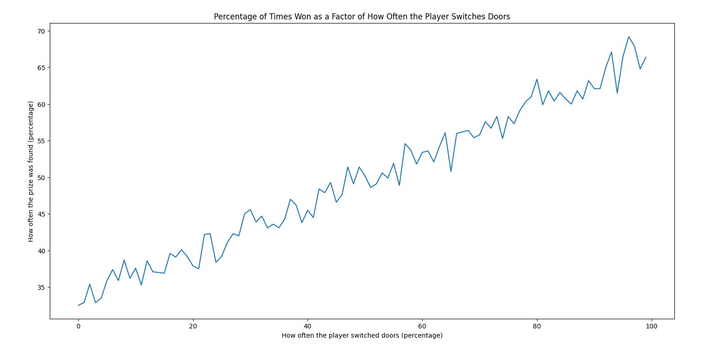

# HallApproaches
A simple function that plays the Monty Hall problem a number of times. Given a percentage between 0-100, the function (player) will switch doors [percentage]% of the time. Wrote this to prove the efficacy of switching doors to myself and some friends after a discussion about the problem yet again.

# Sample Usage
Input:
```play_games(1000, 100)``` Plays 1000 games and switches door everytime. <br />
Output:
```(64.5, 35.5)``` Won prize 64.5% of time, lost 35.5%.

# Looking at output over different risk levels
Input:
```import random
import matplotlib.pyplot as plt
import MontyHall     


view_window = range(0, 100)
score_frame = []

for randomness_level in view_window:
    score_frame.append(MontyHall.play_games(1000, randomness_level)[0])

fig, ax = plt.subplots()
ax.plot(view_window, score_frame)
ax.set_title("Percentage of Times Won as a Factor of How Often the Player Switches Doors")
ax.set_xlabel("How often the player switched doors (percentage)")
ax.set_ylabel("How often the prize was found (percentage)")
plt.show()```

Output:

